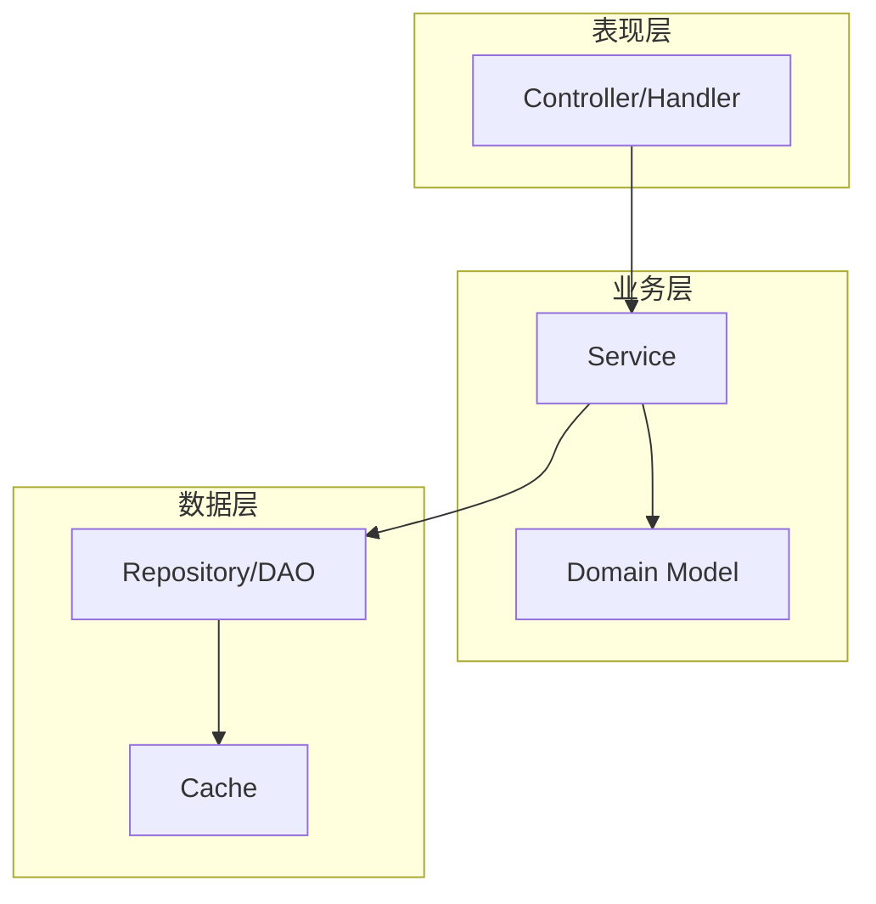
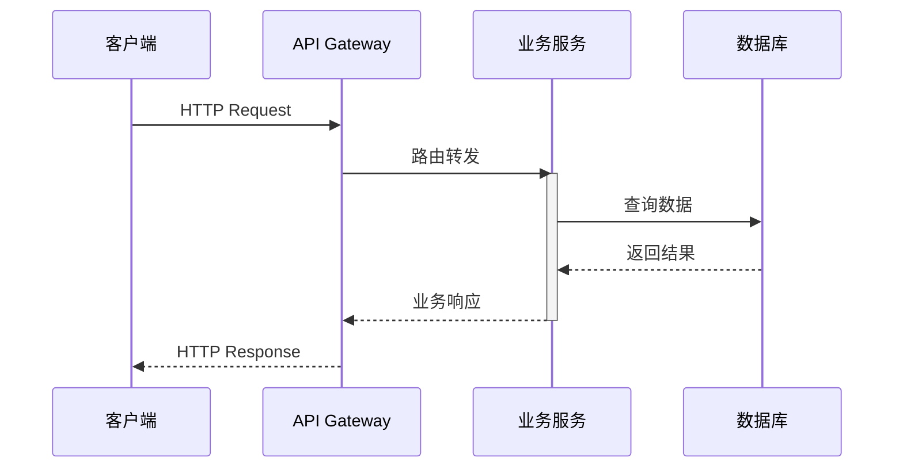
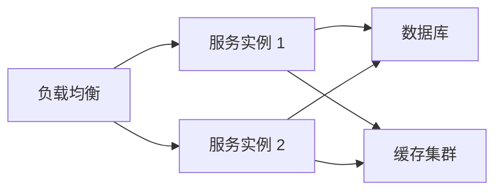
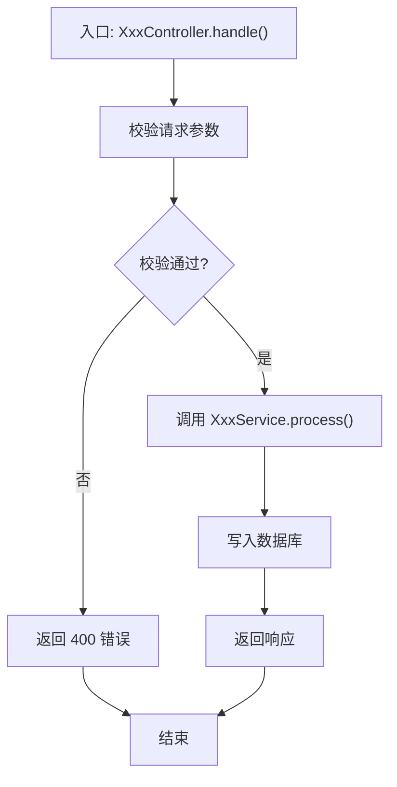

# 架构设计文档模板

## 使用说明

本模板为 code-architecture-analyzer Skill 生成架构设计文档时提供结构参考。根据项目规模和复杂度，可裁剪不必要的章节。所有章节应优先基于代码实际结构填写，避免理想化描述。

---

```markdown
# <系统名称> 架构设计文档

| 属性 | 内容 |
|------|------|
| 版本 | v1.0 |
| 日期 | YYYY-MM-DD |
| 作者 | <分析工具/人员> |
| 适用范围 | <分析覆盖的模块范围> |
| 代码基线 | <Git commit hash 或版本标签> |

---

## 1. 系统概述

### 1.1 业务背景
<系统解决的核心业务问题，1-2 段>

### 1.2 系统定位
<系统在整体技术栈中的位置，上游依赖和下游消费者>

### 1.3 核心能力
- <能力 1>
- <能力 2>
- <能力 3>

---

## 2. 技术栈

| 层级 | 技术选型 | 版本 |
|------|----------|------|
| 语言/运行时 | <如 Java 17 / Node.js 20> | |
| 核心框架 | <如 Spring Boot / Express> | |
| 数据存储 | <如 PostgreSQL / Redis / MongoDB> | |
| 构建工具 | <如 Maven / Gradle / webpack> | |
| 测试框架 | <如 JUnit / pytest / Vitest> | |

---

## 3. 架构视图

### 3.1 逻辑视图（模块结构与依赖）

描述系统的模块划分、每个模块的职责，以及模块间的依赖关系。



**模块职责表**：

| 模块名 | 目录/包路径 | 职责 | 关键文件 |
|--------|------------|------|----------|
| | | | |

### 3.2 进程视图（运行时交互）

描述系统运行时的进程/线程模型、关键交互时序。



### 3.3 部署视图（物理拓扑）

若可从配置文件中推断部署结构（Dockerfile、K8s YAML、docker-compose 等）：



---

## 4. 模块详细设计

### 4.1 <模块 A>

**职责**：

**关键类/接口**：

| 类/接口名 | 类型 | 职责 | 文件路径 |
|-----------|------|------|----------|
| | | | |

**对外接口**：

```java
// 示例：接口定义及主要实现
public interface OrderService {
    Order createOrder(CreateOrderRequest request);
    Order getOrderById(Long id);
}
```

### 4.2 <模块 B>
...

---

## 5. 核心数据流

### 5.1 <流程名称>

**触发条件**：
**涉及模块**：



**详细说明**：
1. ...
2. ...

---

## 6. API 接口设计

### 6.1 接口清单

| 方法 | 路径 | 描述 | 所在文件 |
|------|------|------|----------|
| GET | /api/v1/users | 查询用户列表 | UserController.java:45 |
| POST | /api/v1/orders | 创建订单 | OrderController.java:32 |

### 6.2 典型接口契约

**接口**：`POST /api/v1/orders`

**请求参数**：

| 字段 | 类型 | 必填 | 说明 |
|------|------|------|------|
| | | | |

**响应结构**：

```json
{
  "code": 0,
  "data": {},
  "message": "success"
}
```

**错误码**：

| 错误码 | 说明 | 触发场景 |
|--------|------|----------|
| | | |

---

## 7. 设计模式与架构模式

### 7.1 已识别的设计模式

| 模式 | 应用位置 | 使用评价 |
|------|----------|----------|
| 单例模式 | `DatabaseConnection.java:15` | ✅ 合理使用，管理连接池 |
| 工厂模式 | `PaymentFactory.java` | ⚠️ 有效但缺少对新增类型的扩展说明 |

### 7.2 架构模式判定

<如：分层架构 / MVC / 微服务 / 事件驱动 / CQRS / 六边形架构 等>

---

## 8. 非功能性设计评估

| 维度 | 观察 | 评估 |
|------|------|------|
| 性能 | <如：关键路径有无缓存、数据库查询是否有 N+1> | |
| 安全 | <如：认证鉴权机制、输入校验、敏感数据处理> | |
| 扩展性 | <如：模块耦合度、新增功能的成本> | |
| 可维护性 | <如：代码重复度、测试覆盖率、文档完整性> | |
| 可靠性 | <如：错误处理、重试机制、降级策略> | |

---

## 9. 风险与改进建议

### 9.1 架构债务

1. **问题**：<描述>
   **位置**：<文件/模块>
   **影响**：<对系统的影响>
   **建议**：<改进方向>

### 9.2 设计缺陷

1. **问题**：
   **位置**：
   **建议**：

### 9.3 优化机会

1. **机会**：
   **预期收益**：
```
