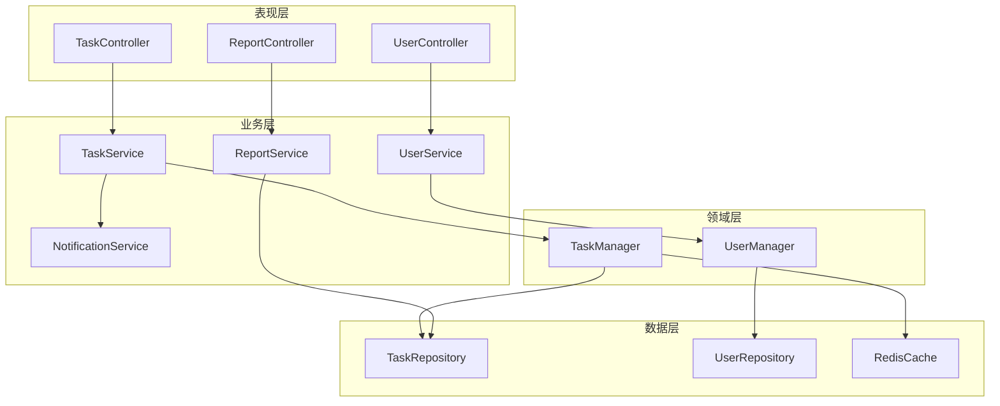
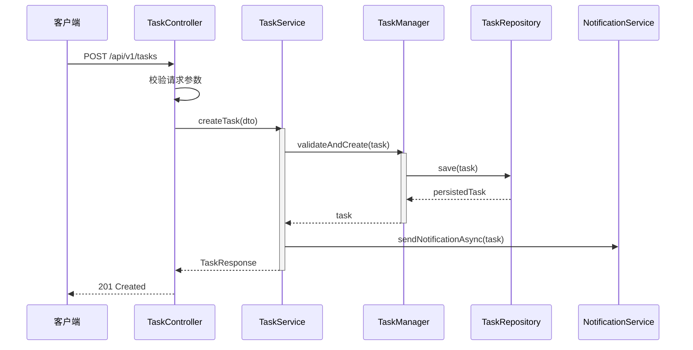

# 架构分析输出示例

本示例展示 code-architecture-analyzer 分析一个中小型项目后的典型输出形态。实际输出应根据项目复杂度裁剪。

---

## 示例项目背景

- **项目**：TaskManager（任务管理系统后端）
- **技术栈**：Java 17 + Spring Boot 3.2 + PostgreSQL + Redis
- **规模**：约 80 个源码文件

---

## 1. 系统概述

TaskManager 提供任务创建、分配、状态跟踪和通知能力。上游为 Web 前端和移动端，下游依赖邮件服务和文件存储服务。

核心能力：
- 任务 CRUD 与生命周期管理
- 用户权限与任务分配
- 异步通知（邮件/站内信）
- 任务统计报表

---

## 2. 技术栈

| 层级 | 技术选型 | 版本 |
|------|----------|------|
| 语言/运行时 | Java | 17 |
| 核心框架 | Spring Boot | 3.2.0 |
| ORM | Spring Data JPA | 3.2.0 |
| 数据存储 | PostgreSQL | 15 |
| 缓存 | Redis | 7 |
| 消息队列 | Spring Async / @EventListener | - |
| 构建工具 | Maven | 3.9 |
| 测试 | JUnit 5 + Mockito | 5.10 |

---

## 3. 架构视图

### 3.1 逻辑视图

**模块职责表**：

| 模块名 | 包路径 | 职责 | 关键文件 |
|--------|--------|------|----------|
| controller | `com.taskmanager.web` | HTTP 请求入口，参数校验 | `TaskController.java`, `UserController.java` |
| service | `com.taskmanager.service` | 业务编排，事务控制 | `TaskService.java`, `NotificationService.java` |
| domain | `com.taskmanager.domain` | 领域逻辑，业务规则 | `TaskManager.java` |
| repository | `com.taskmanager.infrastructure` | 数据访问，ORM 映射 | `TaskRepository.java` |

### 3.2 核心时序：创建任务

---

## 4. 模块详细设计

### 4.1 TaskService

**职责**：任务业务编排，协调领域层、通知服务和数据持久化。

**关键类**：

| 类名 | 类型 | 职责 | 文件路径 |
|------|------|------|----------|
| TaskService | 类 | 任务创建、更新、查询、删除 | `service/TaskService.java:23` |
| TaskManager | 类 | 任务状态机与业务规则校验 | `domain/TaskManager.java:15` |
| TaskRepository | 接口 | JPA 数据访问 | `infrastructure/TaskRepository.java:10` |

---

## 5. 设计模式识别

| 模式 | 应用位置 | 使用评价 |
|------|----------|----------|
| 分层架构 | 整体项目结构 | ✅ 表现/业务/领域/数据四层清晰 |
| 仓库模式 | `TaskRepository` 继承 `JpaRepository` | ✅ Spring Data 标准实现 |
| 门面模式 | `TaskService` 对外隐藏领域层复杂度 | ✅ 合理简化控制器调用 |
| 观察者模式 | `TaskCreatedEvent` + `@EventListener` | ⚠️ 有效，但事件处理缺少失败重试 |

---

## 6. API 分析摘要

### 接口统计
- 总接口数：12
- GET 8, POST 2, PUT 1, DELETE 1
- 文档覆盖率：100%（使用 SpringDoc OpenAPI）

### 规范符合性

| 维度 | 评分 | 说明 |
|------|------|------|
| RESTful 规范 | 8/10 | 资源路径规范，但 `PUT /api/v1/tasks/{id}/assign` 应为 `PATCH` |
| 安全性 | 7/10 | JWT 认证完备，但缺少接口级别权限校验（仅校验登录态） |
| 版本管理 | 6/10 | URL 版本 `/api/v1/`，但无版本升级策略文档 |
| 文档完整性 | 9/10 | OpenAPI 注解完整，含参数说明和响应示例 |

---

## 7. 风险与改进建议

### 7.1 架构债务

1. **问题**：`TaskService` 职责过重（~400 行），同时处理任务逻辑、权限校验和通知触发
   **位置**：`service/TaskService.java`
   **影响**：变更成本高，单测需要大量 Mock
   **建议**：将权限校验提取为 AOP / 拦截器，通知触发提取为独立的事件处理器

2. **问题**：领域层 `TaskManager` 与数据层 `TaskRepository` 存在循环依赖风险
   **位置**：`domain/TaskManager.java:45`
   **影响**：违反依赖倒置原则
   **建议**：`TaskManager` 不直接依赖 Repository，由 Service 层协调

### 7.2 优化机会

1. **机会**：任务查询热点高，可增加 Redis 缓存
   **预期收益**：减少 60%+ 数据库查询

---

*注：本示例为简化演示，实际分析应包含更完整的模块设计和数据流描述。*
