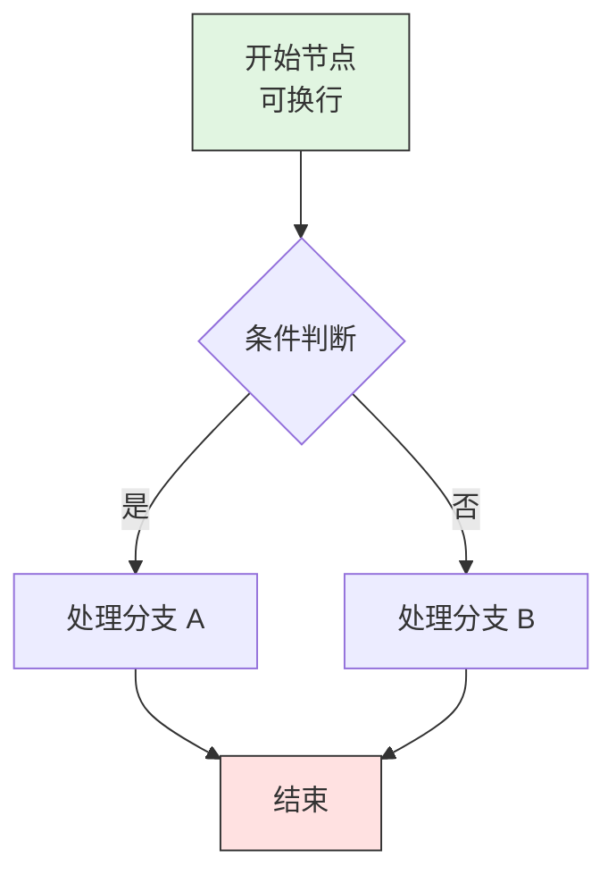
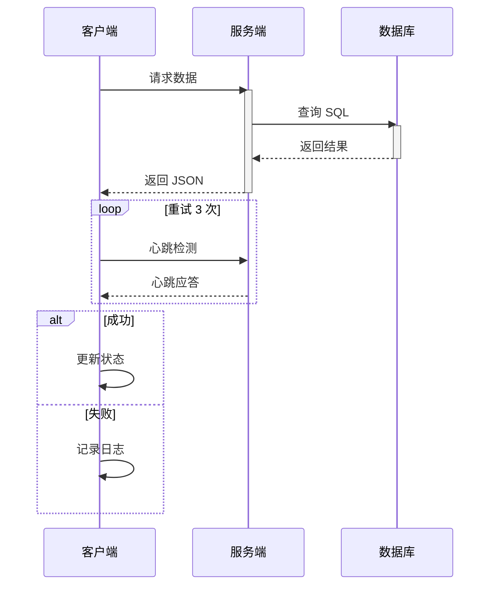
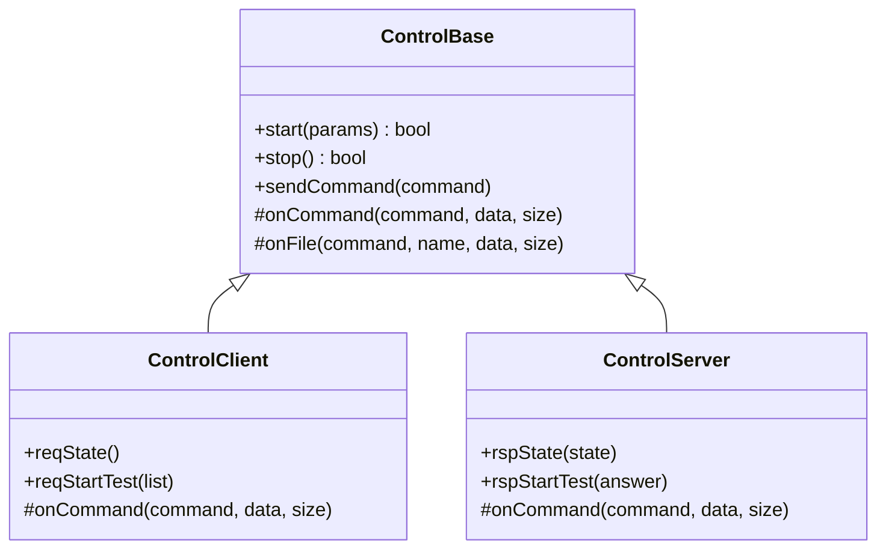
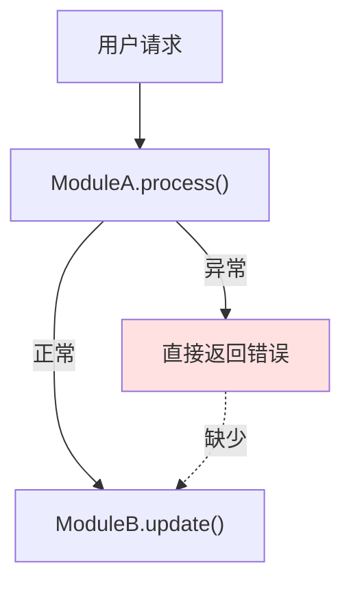
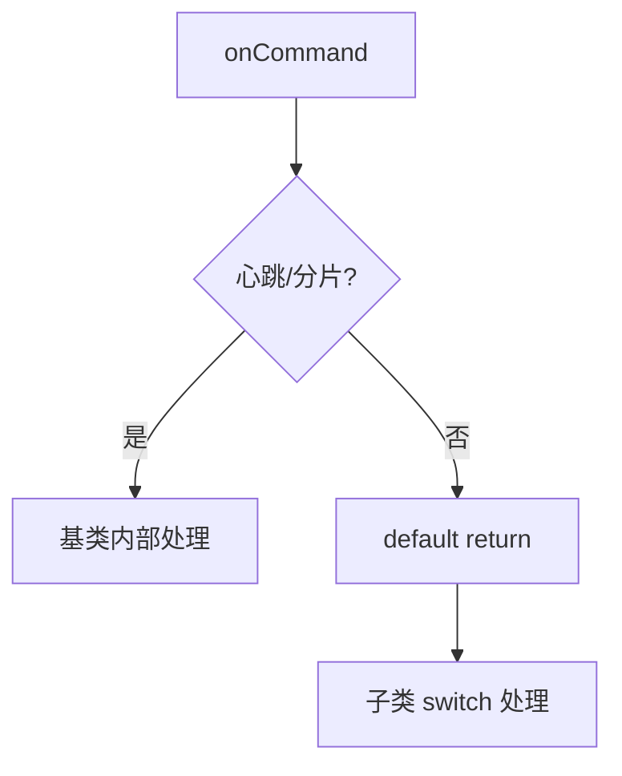

# Mermaid 流程图绘制规范

## 核心原则

1. **能用图就不用文字**：当一段文字描述超过 3 个分支或涉及 3 个以上模块交互时，优先使用 Mermaid 图
2. **图是代码的补充，不是替代**：Mermaid 图旁边必须有对应的代码位置注释（如 `// 见 ControlBase.cpp:143`）
3. **保持简洁**：单张图不超过 15 个节点，复杂流程拆分为多张图

## 图表类型选择指南

| 场景 | 推荐图表类型 | Mermaid 关键字 |
|------|-------------|---------------|
| 函数/模块调用链 | 流程图 | `flowchart TD/LR` |
| 类继承或模块依赖 | 类图 | `classDiagram` |
| 请求-应答时序 | 时序图 | `sequenceDiagram` |
| 状态转换 | 状态图 | `stateDiagram-v2` |
| 并发线程交互 | 时序图 + 循环/条件 | `sequenceDiagram` + `loop/alt` |
| 数据 ETL 流程 | 流程图 | `flowchart LR` |
| 重构前后对比 | 两张并列流程图 | `flowchart TD` × 2 |

## 语法规范

### 1. 流程图（flowchart）



**规范**：
- 节点文本超过 10 个字符时使用 `""` 包裹，支持 `<br/>` 换行
- 条件判断节点用 `{}`（菱形）
- 处理节点用 `[]`（矩形）
- 开始/结束节点用 `()`（圆角矩形）或显式标注
- 箭头标注用 `"|label|"`

### 2. 时序图（sequenceDiagram）



**规范**：
- 用 `participant X as "别名"` 给角色起可读名称
- 同步调用用 `->>`，异步/返回用 `-->>`
- `activate/deactivate` 标记生命周期
- `loop/alt/opt` 描述控制流

### 3. 类图（classDiagram）



**规范**：
- `+` public, `-` private, `#` protected
- 继承用 `|>--`，组合用 `*--`，关联用 `-->`

## SDD 文档中的使用位置

### plan.md —— 在"分析"或"实现步骤"中插入

```markdown
## 分析

问题根因：调用链中 A 模块在异常时未通知 B 模块，导致状态不一致。


```

### tasks.md —— 在复杂 Task 描述中插入

```markdown
### Task 3: 重构命令分发逻辑
- **状态**: pending
- **输入**: `ControlBase::onCommand` 当前实现
- **输出**: 职责分离后的代码 + 更新后的调用链图
- **完成标准**:
    - [ ] 基类只处理心跳/分片
    - [ ] 业务命令下放到子类 switch
    - [ ] 以下 Mermaid 图与代码一致：


```

## 连接指南

### 在 SDD 中的位置

本 Skill 通常被以下 Skill 隐式触发，作为可视化补充：
- `spec-driven-agent`：在 plan.md 中绘制实现流程图
- `code-architecture-analyzer`：在架构文档中绘制模块依赖和时序图
- `solution-validator`：在方案输出中绘制系统架构图

### 入口
- 上述 Skill 的设计/分析阶段涉及 3 个以上模块交互、状态转换或异步流程时

### 出口
- 图表产出后 → 回到调用方 Skill 继续流程

## 一致性检查清单

输出 Mermaid 图后，对照代码验证：

- [ ] 图中每个函数名与代码中的实际函数名一致
- [ ] 图中每个文件路径与代码中的实际路径一致
- [ ] 条件分支的方向（是/否）与代码中的 if/else 逻辑一致
- [ ] 时序图中的消息顺序与代码执行顺序一致
- [ ] 节点数量超过 15 个时，已拆分为多张图
