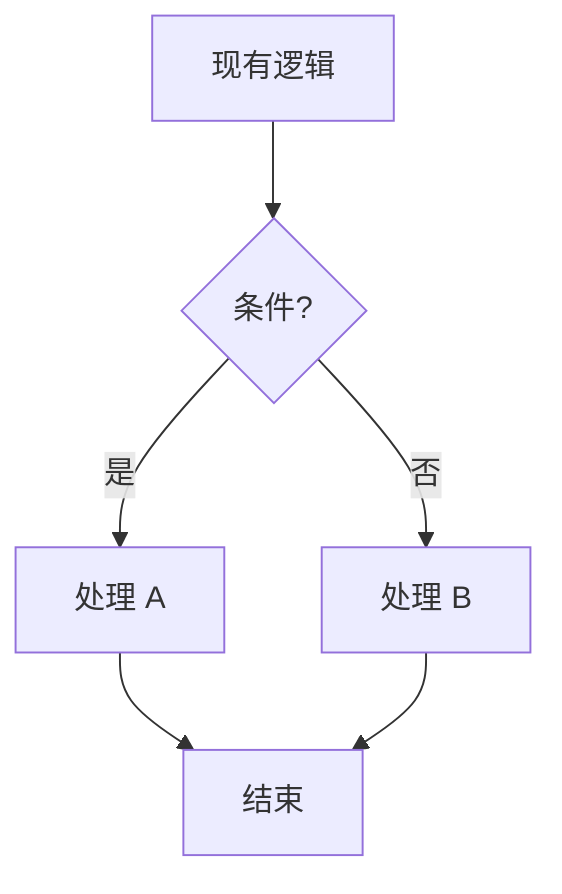

# Spec-Driven Agent 工作流

## 铁律

**1. 代码优先于 Prompt**

面对需求，从底层向上评估，绝不上推：

| 层级 | 手段 | 示例 |
|------|------|------|
| 代码层 | 确定性逻辑 | if/else、正则、模板引擎 |
| CLI 层 | 组合工具 | `grep + jq + curl` |
| Prompt 层 | 单次语义理解 | 文案生成、需求翻译 |
| Agent 层 | 多步推理执行 | 端到端改代码、自动修 bug |

> 能用 10 行 Bash 搞定的，别折腾 AI。

**2. 先设计，后执行**

Vibe Coding（不写设计直接动手）是先易后难。前期省掉的设计时间，后期以 10 倍 debug 时间偿还。

SDD 是先难后易。写 spec 很枯燥，但一旦设计清楚，后续执行、验证、迭代全都有据可循。

> **Day 3 法则**：即使前期用 Vibe Coding 快速验证，第三天也必须补 spec。越早补，代价越小。

## SDD 工作流

```
需求
  ↓
[1] 写 spec.md
  ↓
[2] 写 plan.md
  ↓
[3] 拆 tasks.md
  ↓
[4] 模型自评（五维评分）
       ↓ 综合评分 < 8.0
       └──→ 自我改进 → 回到 [1] 或 [2] 修正
       ↓ 综合评分 ≥ 8.0
[🛑 提交用户审核]
       ↓ 用户提出修改
       └──→ 回到 [1] 或 [2] 修正 → 重新自评
       ↓ 用户确认
[5] 执行 tasks
  ↓
[6] 验证 + 复盘
```

**关键规则**：
- **模型自评 ≥ 8.0 分** 是提交用户审核的硬性门槛。不达标的方案禁止呈现给用户。
- **🛑 用户审核** 是执行前的必经节点。用户未确认前，禁止执行任何代码修改。

## 模型自评（五维评分）

生成 spec + plan + tasks 后，必须按以下五维进行自我评估。每维度满分 10 分，计算综合评分。

**综合评分 = (需求覆盖 + 方案可行 + 边界完整 + 文档自洽 + 可验证性) / 5**

| 维度 | 检查要点 | 扣分项 |
|------|----------|--------|
| **需求覆盖** (10分) | 是否完整理解用户显式和隐含需求 | 遗漏核心功能、误解用户意图 |
| **方案可行** (10分) | 技术方案是否可落地，涉及文件是否准确 | 引用不存在的文件、技术栈不匹配、步骤无法执行 |
| **边界完整** (10分) | 异常场景、空值、错误处理、回退方案；**设计流程图中的每个判断分支是否都分解到了对应 Task 的完成标准中** | 只考虑主流程，无视边界和失败情况；流程图中有前置判断但 Task 完成标准未分配到所有代码入口 |
| **文档自洽** (10分) | spec / plan / tasks 之间是否一致、无矛盾；**Mermaid 流程图与代码实现是否一致** | spec 说做 A，plan 做的是 B；tasks 遗漏 plan 中的步骤；图中函数名与代码不一致 |
| **可验证性** (10分) | 验收标准是否明确、可检查、无模糊词汇 | 使用"优化""完善"等无法验证的描述 |

**评级与动作**：
- 🏆 **≥ 8.0**：可以提交用户审核。简要列出评分和 1-2 个残余风险即可。
- ⚠️ **5.0 - 7.9**：存在明显问题。先自我改进，修正后再重新评分。禁止直接提交用户。
- ❌ **< 5.0**：方案有严重缺陷。必须回到设计阶段重新梳理，不得提交。

---

**📍 当前进度**：阶段 2 / 7 — 方案设计
**➡️ 下一步**：阶段 3 — 用户确认（等待您审核并确认方案后进入）

**🗺️ SDD 完整流程**：
```
[阶段 0] 入口判断 → [阶段 1] 需求澄清 → [阶段 2] 方案设计 → [阶段 3] 用户确认 → [阶段 4] 代码执行 → [阶段 5] 编译验证 → [阶段 5.5] 执行后预自检 → [阶段 6] 代码审查 → [阶段 7] 验收/复盘
```
> 🔵 当前所处阶段：`→ [阶段 2] 方案设计 ←`

### 自评检查清单（内部对照，不输出给用户）

完成自评前，必须逐条核对：
- [ ] 需求确认单中的每条需求，在 spec 中都有对应的设计章节
- [ ] plan.md 中的每一步，在 tasks.md 中都有对应的 Task
- [ ] **流程图-Task 一致性**：设计流程图（Mermaid）中的每个判断分支，是否都在对应 Task 的完成标准中有明确的代码修改点分配
- [ ] tasks.md 中每个 Task 的完成标准都是可检查的（有明确的输入/输出/通过标准）
- [ ] spec / plan / tasks 之间无矛盾
- [ ] **封装边界与可见性**：设计是否明确区分了公开接口与内部实现？内部类型的暴露范围是否受控？
- [ ] **运行时依赖不可见性**：若设计涉及运行时连接机制（信号、事件、回调等），是否已识别这类依赖在编译阶段不可见，并在 plan 中明确验证方式？
- [ ] **第三方库能力边界验证**：若设计依赖第三方库（包括项目内公共库），已确认：
  - 该库在当前平台上实际支持所需功能（非仅头文件接口存在）
  - 已查阅库的官方文档或源码，确认功能完整度
  - 若库不支持某格式/协议/特性，plan 中已明确回退方案（如更换格式、扩展解析器）
- [ ] **API 可实现性预演**：对新增公开接口，已用 5 行伪代码验证签名是否可实现
  - 若接口受语言特性约束（如 const 语义、信号/槽机制、所有权模型），已确认约束与实现意图一致
  - 若接口返回复杂对象，已确认对象生命周期和所有权转移语义符合预期
  - 若接口涉及回调或异步通知，已确认注册/注销/触发三阶段的完整链路可实现
- [ ] **Protobuf 字段名对照验证**：若设计涉及 protobuf 消息的字段访问（getter/setter/枚举值），已确认：
  - 已打开实际生成的 `.pb.h` 文件（或 `.proto` 源文件），核对了字段名、类型、枚举值名称
  - 未基于记忆或假设引用字段名（protobuf 生成的 getter/setter 可能与直觉不同，如字段名 `set_value` 的 getter 是 `set_value()`）
  - 若接口头文件中使用了前向声明（如 `class AICommandResult`），已确认该消息在 proto 中确实存在且命名正确
- [ ] **Skill 文档分层检查**（如本任务是编写/修改 Skill）：
  - 原则章节（核心原则、分工边界）只包含高阶指导，无超过 5 行的具体示例/代码/命令
  - 具体模板、代码示例、命令参数已抽离到 references/ 或细节章节
  - 细节章节通过"例如见 references/xxx.md"与原则章节衔接

### 自评输出格式

向用户呈现方案前，先内部完成自评，然后以以下格式输出：

```
## 方案自评

| 维度 | 得分 | 简要说明 |
|------|------|----------|
| 需求覆盖 | X/10 | ... |
| 方案可行 | X/10 | ... |
| 边界完整 | X/10 | ... |
| 文档自洽 | X/10 | ... |
| 可验证性 | X/10 | ... |

**综合评分：X.X / 10**

### 残余风险
1. ...
2. ...
```

## 三步设计文档

### spec.md —— 把模糊需求变成可验证目标

```markdown
# Spec: <一句话目标>

## 背景
<原始需求或问题描述>

## 目标
<可验证的具体目标，避免模糊词汇>

## 验收标准
- [ ] <具体输入 + 预期输出>
- [ ] <边界行为>
- [ ] <性能或体验要求>

## 约束与范围
- **做**：<明确包含的内容>
- **不做**：<明确排除的内容，防止范围蔓延>

## 参考
- <相关链接、历史 issue>
```

### plan.md —— 把目标变成可落地的方案

```markdown
# Plan: <对应 spec>

## 分析
<问题根因或实现思路，3 段以内>

## 涉及文件
| 文件路径 | 操作 | 说明 |
|----------|------|------|
| `path/to/file` | 修改 | <改什么> |

## 关键流程图（Mermaid）
> 当修改涉及 3 个以上模块交互、状态转换、或异步线程时，必须绘制 Mermaid 流程图。
> 图是代码的补充，不是替代——每张图旁须标注对应代码位置。



## 实现步骤
1. <步骤 1，明确输入输出>
2. <步骤 2，依赖步骤 1>
3. <验证方式>

## 构建产物完整性检查

除代码文件外，Plan 必须明确以下非代码产物的验收标准：

- [ ] **配置文件/资源文件**：项目所需的运行时资源（配置文件、模板、国际化文件、静态资源等）是否已纳入构建和部署流程
  - 构建系统是否已配置将资源复制到输出目录的规则
  - 构建完成后，输出目录中是否包含这些资源（需明确验证方式）
- [ ] **安装/分发规则**：如需支持包管理安装（如 `find_package`、`pip install`、`npm publish`），是否已配置安装规则和导出目标
  - 验证方式：执行安装命令后检查目录结构和文件完整性
- [ ] **运行时依赖部署**：项目是否有外部运行时依赖（如动态库、运行时环境、依赖包），构建后是否自动收集到输出目录
- [ ] **文档与示例**：新增功能是否伴随用法示例（Demo、文档片段、API 使用范例）

## 编译验证步骤
1. <编译命令，如 `cmake --build build --target MyTest`>
2. <测试运行命令，如 `./MyTest.exe`>
3. <预期编译/运行结果>

> **注意**：plan 中记录的编译命令仅为预设方案。实际执行编译验证前，必须再次向用户请示并获得明确授权，禁止自主执行编译。

## 风险评估
<副作用及回退方案>
```

### tasks.md —— 把方案拆成最小可执行单元

```markdown
# Tasks: <对应 plan>

## 任务列表

### Task 1: <简短描述>
- **状态**: pending
- **输入**: <明确的上下文或文件>
- **输出**: <预期产物>
- **完成标准**: <可验证的条件>
- **依赖**: <无 / Task X>

### Task N: 编译验证与测试运行
- **状态**: pending
- **输入**: 已完成的所有代码文件、构建系统配置
- **输出**: 编译日志、测试运行结果
- **完成标准**:
    - [ ] 代码能通过项目原有构建系统编译（不引入计划外的构建系统配置修改）
    - [ ] 测试用例运行通过（或至少编译通过）
    - [ ] 修复的编译问题记录到执行记录
    - [ ] plan.md 中的 Mermaid 流程图与最终代码一致（函数名、调用链、分支方向）
- **依赖**: 所有前置 Task

## 执行记录
- <时间戳>: <事件，包括失败和重试>
```

## constitution.md —— 让 AI 在框架内工作

项目级架构约束，防止 AI 自由发挥导致代码腐烂：

```markdown
# Constitution: <项目名> 架构约束

## 目录结构约定
- `src/components/` — 仅展示组件
- `src/services/` — 仅 API 调用层

## 模块边界
- 前端禁止直接调数据库
- 公共工具函数必须放 `src/utils/`

## 命名规则
- 组件 PascalCase，工具函数 camelCase

## 红线
- 禁止三层抽象解决一个函数能搞定的问题
- 禁止重复工具方法散落在多个文件
```

## 执行与复盘

用户确认后执行。执行完成后必须：

1. **验证**：对照 spec.md 的验收标准逐条检查
2. **预自检（Pre-review）**：在触发正式 code-review 前，以执行者视角做一次自我审查（参见 spec-driven-dev 阶段 5.5）。重点检查：
   - 是否有计划外的文件修改（`git diff` 比对 plan.md 文件清单）
   - 核心逻辑的所有分支是否都已实现，非只写了主流程
   - 运行时连接（信号、事件、回调）的完整链路是否存在
   - 资源释放路径是否完整
   - **工具链能力与可用实例预检**：在触发编译验证前，确认当前环境存在满足项目语言标准（如 C++17/C++20）的编译器实例。使用 `vswhere -all -format json`（Windows）或 `which g++ clang++`（Unix）枚举可用工具链；若项目要求 C++17，禁止直接依赖 VS 2015 等不完全支持 C++17 的默认编译器。记录实际使用的编译器版本到 `workflow-state.md` 的 `compiled.compiler` 字段。
   - 发现阻塞问题立即修复并重新编译验证
3. **复盘**：记录实际执行与计划的偏差，沉淀到 `tasks.md` 的执行记录中

---

**📍 当前进度**：阶段 5.5 / 7 — 执行后预自检
**➡️ 下一步**：阶段 6 — 代码审查（预自检通过后将自动触发）

**🗺️ SDD 完整流程**：
```
[阶段 0] 入口判断 → [阶段 1] 需求澄清 → [阶段 2] 方案设计 → [阶段 3] 用户确认 → [阶段 4] 代码执行 → [阶段 5] 编译验证 → [阶段 5.5] 执行后预自检 → [阶段 6] 代码审查 → [阶段 7] 验收/复盘
```
> 🔵 当前所处阶段：`→ [阶段 5.5] 执行后预自检 ←`

留痕不是为了 debug，而是为了进化。

## 完整文档模板

上述模板的完整版见 [references/sdd-templates.md](references/sdd-templates.md)。

---

## 连接指南：上一步从哪来，下一步到哪去

### 入口
- **来自 requirement-clarifier**：需求已澄清，用户已确认需求确认单，进入 [1] 写 spec.md
- **直接入口**：用户直接给出明确需求（有具体输入/输出/边界），跳过澄清，直接从 [1] 开始

### 出口
- **执行完成后** → 触发 **[code-review]**：代码已产出，必须进行审查，对照 plan/constitution 检查质量
- **审查不通过** → 回到本 Skill 的 [4] 或 [5]，按审查意见修复后重新执行

### 典型场景完整链路

```
修 Bug 场景：
  测试反馈 bug → requirement-clarifier（澄清现象/复现步骤）
    → spec-driven-agent（写修复 spec → 审核 → 执行修复）
    → code-review（审查修复代码）
    → execution-retrospective（复盘：为什么漏了这个 bug？如何防止再犯？）

新功能场景：
  用户提需求 → requirement-clarifier（需求模糊时）
    → spec-driven-agent（SDD 全流程）
    → code-review
    → execution-retrospective（沉淀可复用模式）
```
